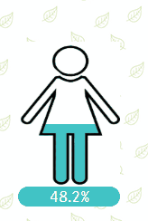
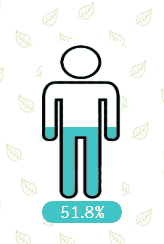

# ImageColorFill
<h3>
1 Measure is to be added 
</h3>
<h3>
KPI Settings 
</h3>
<ul>
	<li>Width in % : Width can be adjusted</li>
	<li>Height in % : Height can be adjusted</li>
	<li>Fill BgColor : Container Background Color</li>
	<li>My Media : Image from content library</li>
</ul>
<h3>
Note : Media Image should be transparent where color has to be filled
</h3>
<h1>Demo</h1>

